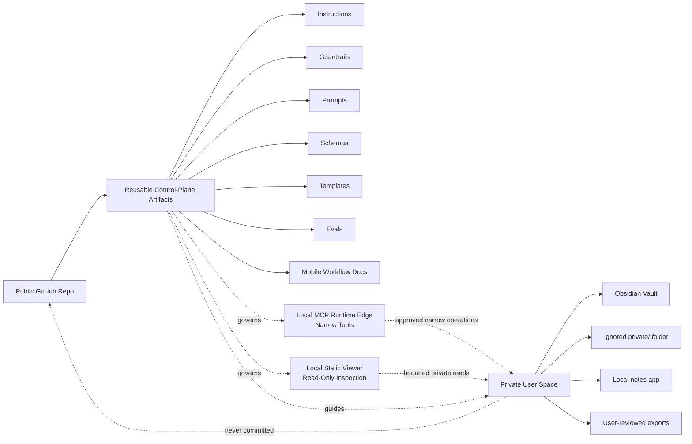

# Architecture

`journal-agent` separates public reusable artifacts from private user-owned journal content.

The public GitHub repository is the control plane: instructions, guardrails, prompts, schemas, templates, evals, docs, and validation scripts. These artifacts can be inspected, versioned, reviewed, and governed without exposing private journal data.

The private user space is the data plane: journal entries, copied excerpts, user-reviewed reflections, durable memory, temporary state, exports, and any sensitive notes. That data belongs in a private Obsidian vault, ignored local folders, a local notes app, or another user-controlled private system.

See `docs/obsidian-private-runtime-guide.md` for an optional, manual setup using Obsidian or another private notes system. The guide is setup documentation, not a committed private vault, and it does not implement a live runtime, plugin, server, connector, or automated persistence.

The minimal local MCP server is a narrow runtime edge inside the private environment, between explicitly scoped operations and the private data plane. `docs/mcp-local-server.md` documents the local implementation, `docs/local-runtime-viewer.md` documents the optional local static inspection surface, and `docs/future-mcp-vps-controller-contract.md` defines the broader contract and future VPS boundary. No VPS service, live connector configuration, hosted endpoint, or tunnel is implemented.

## Public Control Plane

Public artifacts describe how the companion should work without including real journal content:

- `AGENTS.md`, `GUARDRAILS.md`, `PRIVACY.md`, and `SECURITY.md` define boundaries.
- `prompts/` and `templates/` define reusable interaction surfaces.
- `schemas/` and `OUTPUT_FORMATS.md` define output contracts.
- `evals/` and `EVALS.md` define synthetic safety and privacy checks.
- `mobile/` explains phone-first workflows that keep journal data in user-controlled tools.

## Private Data Plane

Private user space contains real journal data and generated private artifacts. It can include:

- Raw entries and selected excerpts.
- User-reviewed reflections and summaries.
- Therapy-prep notes owned by the user.
- Crisis notes or safety-related personal information.
- Runtime exports, local logs, memory, and state.

These materials must not be committed to the public repo.

## Runtime Edge

The local server runs within the private runtime boundary, accepts only an explicit initialized vault root and narrow file scope, and preserves separate Memory and State destinations. It cannot scan the vault or monitor in the background. Its issue #31 apply path appends only exact wording reviewed for one destination after destination-specific confirmation, target allowlist checks, and State trigger checks.

## Memory vs State

Memory is durable user-owned information that may be reused later only with explicit consent.

State is temporary or resumable execution context for a session, workflow, or reflection run.

Both real memory and real state are private user data and must not be committed to the public repo.

## Design-Time, Runtime, and Iteration Artifacts

Design-time artifacts define the intended system before use: instructions, guardrails, prompts, templates, schemas, and architecture docs.

Runtime artifacts are created during actual use: journal entries, generated reflections, workflow state, durable memory, exports, logs, and copied excerpts. Real runtime artifacts are private unless they are synthetic examples.

Iteration artifacts improve the system over time: eval cases, checklists, changelog entries, backlog notes, and decision records. Public iteration artifacts must not include private runtime data.

## Synthetic Examples Only

Examples in public docs, schemas, evals, prompts, and templates must be synthetic. Do not use real names, real journal excerpts, identifying details, employer-specific examples, screenshots, local user paths, raw logs, or private summaries.
