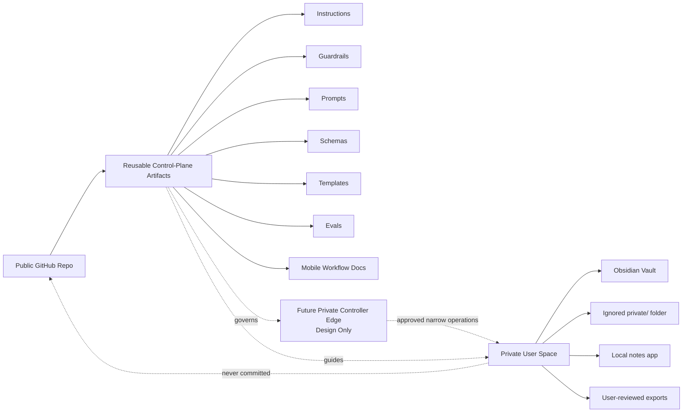

# Architecture

`journal-agent` separates public reusable artifacts from private user-owned journal content.

The public GitHub repository is the control plane: instructions, guardrails, prompts, schemas, templates, evals, docs, and validation scripts. These artifacts can be inspected, versioned, reviewed, and governed without exposing private journal data.

The private user space is the data plane: journal entries, copied excerpts, user-reviewed reflections, durable memory, temporary state, exports, and any sensitive notes. That data belongs in a private Obsidian vault, ignored local folders, a local notes app, or another user-controlled private system.

See `docs/obsidian-private-runtime-guide.md` for an optional, manual setup using Obsidian or another private notes system. The guide is setup documentation, not a committed private vault, and it does not implement a live runtime, plugin, server, connector, or automated persistence.

A possible future controller would be a narrow runtime edge inside the private environment, between user-approved operations and the private data plane. `docs/future-mcp-vps-controller-contract.md` defines that design boundary. No controller, MCP server, VPS service, vault reader, or live runtime is implemented in this repository.

## Public Control Plane

Public artifacts describe how the companion should work without including real journal content:

- `AGENTS.md`, `GUARDRAILS.md`, `PRIVACY.md`, and `SECURITY.md` define boundaries.
- `prompts/` and `templates/` define reusable interaction surfaces.
- `schemas/` and `OUTPUT_FORMATS.md` define output contracts.
- `evals/` and `EVALS.md` define synthetic safety and privacy checks.
- `mobile/` explains phone-first workflows that keep journal data in user-controlled tools.

## Private Data Plane

Private user space contains real journal data and generated private artifacts. It can include:

- Raw entries and selected excerpts.
- User-reviewed reflections and summaries.
- Therapy-prep notes owned by the user.
- Crisis notes or safety-related personal information.
- Runtime exports, local logs, memory, and state.

These materials must not be committed to the public repo.

## Future Runtime Edge

If implemented later, a controller must run within the private runtime boundary, accept only explicit user-selected scope, expose least-privilege operations, and preserve separate review gates for Memory and State. It must not scan the vault, monitor in the background, or persist private artifacts without destination-specific confirmation. The controller contract is a specification, not current access or executable behavior.

## Memory vs State

Memory is durable user-owned information that may be reused later only with explicit consent.

State is temporary or resumable execution context for a session, workflow, or reflection run.

Both real memory and real state are private user data and must not be committed to the public repo.

## Design-Time, Runtime, and Iteration Artifacts

Design-time artifacts define the intended system before use: instructions, guardrails, prompts, templates, schemas, and architecture docs.

Runtime artifacts are created during actual use: journal entries, generated reflections, workflow state, durable memory, exports, logs, and copied excerpts. Real runtime artifacts are private unless they are synthetic examples.

Iteration artifacts improve the system over time: eval cases, checklists, changelog entries, backlog notes, and decision records. Public iteration artifacts must not include private runtime data.

## Synthetic Examples Only

Examples in public docs, schemas, evals, prompts, and templates must be synthetic. Do not use real names, real journal excerpts, identifying details, employer-specific examples, screenshots, local user paths, raw logs, or private summaries.
